# 쇼핑몰 프로젝트

- 마케터로 일할 때 플랫폼 사용에 대한 한계로 아쉬웠던 경험이 많아 쇼핑몰을 첫 프로젝트로서 만들게 되었습니다.
- 또한 회원가입, 인증, 결제 및 CRUD 등 기초적이지만 중요한 기술들을 연습하기에 좋다고 생각했습니다.

## About

- 개발 기간 : 2023.05 ~ 
- 개발 인원 : 1명 (개인 프로젝트)
- Version 1 : 장고 템플릿을 이용해 fullstack 개발
- Version 2 :
	- 1. 기존 사이트는 유지하면서 DRF를 이용해 백엔드와 프론트 엔드 분리 (개발중)
	- 2. 유닛/통합 테스트 진행

## Version 1 기술스택

| 개발환경   | -                |
| ---------- | ---------------- |
| 언어       | Python - 3.11      |
| 프레임워크 | Django - 4.2.2      |
| DB         | PostgreSQL - 15.3 |
| API        |       카카오페이, PayPal, Daum 주소 API          |
| Devops           |    AWS - Elastic Beanstalk, S3, RDS, Route53, VPC, IAM               |


## 1. 아키텍처

### a. AWS Elastic Beanstalk 서비스 아키텍쳐

```mermaid
graph TD
    %% ──────────────── 루트 레이어 ────────────────
    greatkart["Django Root"] -->|INSTALLED_APPS| accounts
    greatkart --> carts
    greatkart --> category
    greatkart --> store
    greatkart --> orders
    greatkart --> tests["tests (pytest)"]

    %% ──────────────── 각 앱 ────────────────
    subgraph accounts
        acc_models[(models.py)]
        acc_views[views.py & views_api.py]
        acc_serializers[serializers.py]
        acc_forms[forms.py]
        acc_urls[urls.py]
        acc_models --> acc_views
        acc_views --> acc_urls
        acc_views --> acc_serializers
    end

    subgraph carts
        cart_models[(models.py)]
        cart_views[views.py]
        cart_processors[context_processors.py]
        cart_urls[urls.py]
        cart_models --> cart_views
        cart_views --> cart_urls
    end

    subgraph category
        cat_models[(models.py)]
        cat_views[views.py]
        cat_processors[context_processors.py]
        cat_models --> cat_views
    end

    subgraph store
        store_models[(models.py)]
        store_views[views.py]
        store_forms[forms.py]
        store_urls[urls.py]
        store_models --> store_views
        store_views --> store_urls
    end

    subgraph orders
        order_models[(models.py)]
        order_views[views.py]
        order_forms[forms.py]
        order_urls[urls.py]
        order_models --> order_views
        order_views --> order_urls
    end
```




### b. Project Structure

<details>
<summary><b> 이미지 펼쳐보기 (클릭)  👈 </b></summary>
<div markdown="1">


```
├─ accounts 
│  ├─ admin.py
│  ├─ apps.py
│  ├─ forms.py
│  ├─ helpers.py
│  ├─ models.py
│  ├─ serializers.py
│  ├─ tests.py
│  ├─ urls.py
│  ├─ views.py
│  └─ views_api.py
├─ carts
│  ├─ admin.py
│  ├─ apps.py
│  ├─ context_processors.py
│  ├─ models.py
│  ├─ tests.py
│  ├─ urls.py
│  └─ views.py
├─ category
│  ├─ admin.py
│  ├─ apps.py
│  ├─ context_processors.py
│  ├─ models.py
│  ├─ tests.py
│  ├─ views.py
│  └─ __init__.py
├─ greatkart
│  ├─ asgi.py
│  ├─ settings.py
│  ├─ static
│  ├─ tests
│  │  ├─ conftest.py
│  │  ├─ factories.py
│  │  ├─ test_accounts
│  │  │  ├─ test_endpoints.py
│  │  │  ├─ test_forms.py
│  │  │  ├─ test_models.py
│  │  │  ├─ test_views.py
│  │  │  └─ __init__.py
│  │  └─ __init__.py
│  ├─ urls.py
│  ├─ views.py
│  ├─ wsgi.py
│  └─ __init__.py
├─ manage.py
├─ orders
│  ├─ admin.py
│  ├─ apps.py
│  ├─ forms.py
│  ├─ models.py
│  ├─ tests.py
│  ├─ urls.py
│  ├─ views.py
│  └─ __init__.py
├─ pytest.ini
├─ README.md
├─ requirements.txt
├─ static
├─ store
│  ├─ admin.py
│  ├─ apps.py
│  ├─ forms.py
│  ├─ models.py
│  ├─ tests.py
│  ├─ urls.py
│  ├─ views.py
│  └─ __init__.py
└─ templates
```
</div>
</details>


### c. 데이터 베이스 테이블 구조


## 2. 기능 구현 이미지

### 목차

<details>
<summary><b> 목차 펼쳐보기 (클릭)  👈 </b></summary>
<div markdown="1">

- User
	- 로그인 / 로그아웃
	- 회원가입 
		- 이메일 토큰 링크를 통한 본인인증
	- 대시보드
		- 프로필, 마이페이지, 주문조회
- Review
	- 각 리뷰 평균 및 카운팅
	- 회원 및 구매한 이력이 있을 경우만 댓글 달기 가능
- Search
	- 쿼리에 걸리는 아이템 갯수 카운팅
	- 검색 기능
- Payment
	- SDK 와 REST API 두 가지 방법으로 개발
		- SDK 는 PayPal
  		- REST API 는 카카오 페이 
- Paginator
	- Paginator 내장 함수로 구현
- Cart
	- 장바구니에서 아이템 추가 및 삭제
	- 세션을 통해 로근인 했을 때 중복된 상품이 있을 경우 상품 증가
	- 그렇지 않은 경우 장바구니에 새로 추가
	- 주소 찾기는 Daum API로 구현
- Sort by
	- 카테고리 및 필터기능 적용
		 - 폼 형식으로 랜더링
 
</div>
</details>

<br>

---

### User

> 1. 장고의 기본 BaseUserManager, AbstractBaseUser 를 이용해서 회원가입 모델을 구현했습니다.
> 2. 핸드폰 번호의 유효성 검사의 경우 `PhoneNumberField` 라이브러리를 사용해 구현했습니다.
> 3. 회원가입을 할 때 가입한 이메일로 토큰을 보내고 해당 링크로 접속했을 때의 pk와 토큰이 일치할 경우에만 본인인증이 확인되어 계정이 활성화 되도록 구현했습니다.

#### 회원가입 및 본인인증
- 비밀번호 일치 및 핸드폰, 이메일 유효성 검사를 구현했습니다.
- 회원가입을 했을 경우 본인인증된 이메일을 통해서만 계정이 활성화 됩니다.
	- 회원 가입시 기재한 이메일 주소로 토큰과 uid와 대조하여 본인 인증을 진행합니다.
<details>
<summary><b> gif 이미지 펼쳐보기 (클릭)  👈 </b></summary>
<div markdown="1">

</div>
</details>

<br>

#### 비밀번호 찾기
- 가입한 이메일 주소가 존재할 경우 해당 이메일이 전송됩니다.
- 회원가입과 같은 방식으로 본인인증이 진행되며 본인인증이 완료되면 새로운 비밀번호를 설정 할합니다.
- 새로운 비밀번호로 로그인에 성공하면 계정이 다시 활성화됩니다.
<details>
<summary><b> gif 이미지 펼쳐보기 (클릭)  👈 </b></summary>
<div markdown="1">

</div>
</details>

<br>

#### 프로필 사진 및 비밀번호 변경

- 회원가입 때 기본으로 생성된 프로필이 변경 가능하며 비밀번호도 변경이 가능합니다.
<details>
<summary><b> gif 이미지 펼쳐보기 (클릭)  👈 </b></summary>
<div markdown="1">

</div>
</details>

<br>

#### 주문번호 확인
<details>
<summary><b> gif 이미지 펼쳐보기 (클릭)  👈 </b></summary>
<div markdown="1">

</div>
</details>

<br>

---

### Review

> Review 기능은 크게 두 가지로 나눠서 살펴볼 수 있습니다.
> 	1. 회원과 비회원 그리고 구매자와 비 구매자를 각각 나눠서 유저의 경로가 달라집니다.
> 	2. 아이템마다 각각 달리는 리뷰 개수 와 총 별점의 평균을 나타냅니다.


#### 비회원일 때 댓글을 달 수 없는 기능

- 로그인이 되어있지 않은 경우 로그인 페이지가 나옵니다.
- 로그인이 되어있는 상태이지만 물건을 구매한 적이 없다면 리뷰를 달 수 없습니다.


#### 회원일 때 댓글을 달 수 있는 기능
<details>
<summary><b> gif 이미지 펼쳐보기 (클릭)  👈 </b></summary>
<div markdown="1">

</div>
</details>

- 회원일 경우 리뷰를 남길 수 있으며 리뷰를 남김과 동시에 제품에 총 리뷰 개수가 카운팅 되며 별점은 전체 별점 총 평균에 반영됩니다.

<br>

#### 평균 별점 반영 및 리뷰 개수 카운팅
<details>
<summary><b> gif 이미지 펼쳐보기 (클릭)  👈 </b></summary>
<div markdown="1">

</div>
</details>

<br>

---

### Search

> 검색 기능은 판매자가 상품을 등록할 때 설명이나 제품명이 키워드에 걸리면 반영해 주는 쿼리를 반영합니다.
> 해당 쿼리에 걸리는 상품 개수를 카운팅 합니다.

<details>
<summary><b> gif 이미지 펼쳐보기 (클릭)  👈 </b></summary>
<div markdown="1">

</div>
</details>

<br>

---

### Payment
>  결제 방식은 SDK 와 REST API 두 가지 방법을 사용했고
>  SDK 방식은 페이팔, REST API 방식은 카카오 페이를 선택했습니다.

#### 카카오페이 
<details>
<summary><b> gif 이미지 펼쳐보기 (클릭)  👈 </b></summary>
<div markdown="1">

</div>
</details>

<br>


#### 페이팔 
<details>
<summary><b> gif 이미지 펼쳐보기 (클릭)  👈 </b></summary>
<div markdown="1">

</div>
</details>

<br>

---

### Paginator 
> 장고에서 제공하는 Paginator를 사용하여 페이지 단위를 구현했습니다.  
<details>
<summary><b> gif 이미지 펼쳐보기 (클릭)  👈 </b></summary>
<div markdown="1">

</div>
</details>

<br>

---

### Cart

> 1. 장바구니에서 아이템 추가 및 삭제를 구현했습니다.
> 2. 세션을 활용하여 비로그인 상태에서 장바구니에 물건을 담았다가 로그인을 했을 때 중복된 상품이 있을 경우는 해당 상품의 개수가 늘어나고 그렇지 않은 경우에는 새로 장바구니에 추가되도록 구현했습니다.
> 3. 주소 찾기는 DAUM API를 이용했습니다. 
<details>
<summary><b> gif 이미지 펼쳐보기 (클릭)  👈 </b></summary>
<div markdown="1">

</div>
</details>

<br>

---

### Sort by

> 상품을 필터링할 때 다음과 같은 알고리즘으로 만들었습니다.


( 개발할 당시에는 자료구조에 대해 잘 몰라서 if문으로만 구현했지만 이번에 자료구조를 공부하면서 더 좋은 방법으로 만들 수 있을 것 같아 DRF 버전을 개발할 때 적용하려고 합니다!)

<br>

---

### 카테고리 및 필터링 적용

<details>
<summary><b> gif 이미지 펼쳐보기 (클릭)  👈 </b></summary>
<div markdown="1">

</div>
</details>


<br>


## 3. 핵심 문제 해결 경험


### 🔥 1. AWS 클라우드 배포 및 데이터 마이그레이션

**가장 큰 난관은 로컬에서 개발한 서비스를 실제 사용자가 접근할 수 있는 클라우드 환경에 배포하는 것이었습니다.**     
AWS에 대한 지식이 부족한 상태에서 인프라를 구축하고, 특히 개발 환경의 SQLite DB를 프로덕션 환경의 PostgreSQL로 마이그레이션하는 과정에서 큰 어려움을 겪었습니다.

#### 🔧 문제점: 이기종 데이터베이스 간의 데이터 마이그레이션

- **문제 상황:** 
	- 로컬 개발 환경에서는 가벼운 `SQLite`를 사용했지만, 실제 서비스 환경에서는 안정성과 확장성을 위해 `PostgreSQL`을 사용해야 했습니다. 
	- 두 데이터베이스는 구조가 달라 단순히 데이터를 복사할 수 없었고, 이미 쌓인 개발 데이터를 어떻게 손실 없이 이전할지 막막했습니다.
- **가설 수립:**
    1. Django는 여러 데이터베이스 시스템과 높은 호환성을 제공한다.
    2. 그렇다면, 특정 데이터베이스에 종속되지 않는 `JSON`과 같은 표준 데이터 형식으로 데이터를 추출(dump)할 수 있을 것이다.
    3. 추출한 JSON 데이터를 새로운 PostgreSQL 데이터베이스 스키마에 맞춰 다시 주입(load)하면 데이터 마이그레이션이 가능할 것이다.

#### 💡 해결 과정

1. **데이터 추출:** Django의 내장 기능인 `dumpdata` 명령어를 사용하여 로컬 SQLite 데이터베이스의 모든 데이터를 `JSON` 파일 형식으로 추출했습니다.

```
python manage.py dumpdata > datadump.json
```

2. **인프라 구축:** 
	- AWS `Elastic Beanstalk`을 사용하여 애플리케이션 배포 환경을 구성하고, 데이터베이스는 `RDS for PostgreSQL` 인스턴스를 생성했습니다. 
	- 보안을 위해 `VPC` 내부에서만 애플리케이션 서버와 RDS가 통신하도록 네트워크를 설정했습니다.
3. **데이터 주입:** 
	- AWS에 배포된 Django 애플리케이션 환경에서, `loaddata` 명령어를 통해 백업해 둔 `datadump.json` 파일을 PostgreSQL DB로 성공적으로 이관했습니다. 
	- 이 과정을 통해 데이터 손실 없이 프로덕션 환경으로의 전환을 완료했습니다.

#### ✅ 성과

- **클라우드 인프라 구축 능력:** 
	- 가상 서버(EC2), 데이터베이스(RDS), 스토리지(S3) 등 AWS의 핵심 서비스를 직접 다루며 클라우드 환경에 대한 깊은 이해를 얻었습니다.
- **논리적 문제 해결 능력:** 
	- '데이터 마이그레이션'이라는 막연한 문제 앞에서, '표준 형식을 통한 데이터 이관'이라는 가설을 세우고 Django의 내장 기능을 활용해 직접 문제를 해결했습니다.


### 🔥 2. 보안을 고려한 인증 플로우 설계

단순한 로그인 기능을 넘어, 실제 서비스의 안정성을 위협할 수 있는 다양한 보안 시나리오를 고려하여 사용자 인증 시스템을 설계했습니다.

#### 🔧 문제점: 이메일 도용 및 무차별 로그인 공격 방지

- **문제 상황:** 
	- 회원가입 시 이메일 주소의 실제 소유 여부를 확인하지 않으면 유령 계정이 양산될 수 있습니다. 
	- 또한, 어드민 페이지가 외부에 노출될 경우 무차별 대입 공격(Brute-force attack)에 취약해질 수 있습니다.
- **가설 수립:**
    1. 계정 활성화 전, 이메일로 일회성 토큰을 보내 본인 소유의 이메일임을 증명하게 하면 유령 계정을 막을 수 있다.
    2. 실제 어드민 로그인 경로는 숨기고, 가짜 로그인 페이지를 외부에 노출시켜 공격 시도를 유도하면 공격자의 IP를 추적하고 차단할 수 있다.


#### 💡 해결 과정

1. **토큰 기반 이메일 인증:** 
	- 사용자가 회원가입을 하면, 계정은 비활성 상태로 생성됩니다. 동시에 Django의 `EmailMultiAlternatives`와 `urlsafe_base64_encode`를 사용하여 사용자 ID와 일회성 토큰이 포함된 인증 링크를 이메일로 발송합니다. 
	- 사용자가 이 링크를 클릭해야만 계정이 활성화되도록 구현했습니다.
2. **가짜 어드민 페이지(Honeypot):** 
	- 일반적인 `/admin` URL로 접근 시, 실제 로그인 페이지가 아닌 가짜 로그인 페이지를 보여줍니다. 
	- 이 페이지에서 로그인을 시도하는 모든 요청의 IP 주소를 기록하고, 특정 횟수 이상 실패 시 해당 IP를 차단하는 로직을 추가하여 보안을 강화했습니다. 
	- 실제 관리자 페이지는 `/securelogin`과 같이 예측하기 어려운 경로로 설정했습니다.

#### ✅ 성과

- **안전한 사용자 인증 시스템 구축:** 
	- 이메일 소유권 인증을 통해 서비스의 신뢰도를 높이고, 허니팟(Honeypot) 전략으로 관리자 페이지에 대한 무차별 공격을 효과적으로 방어했습니다.
- **보안에 대한 깊은 이해:** 
	- 일반적인 기능 구현을 넘어, 발생 가능한 보안 위협을 먼저 예측하고 방어적인 코드를 작성하는 경험을 했습니다.

  

### 🔥 3. 복잡한 커머스 로직 구현

익명 사용자와 로그인 사용자의 경험을 모두 고려하고, 서로 다른 방식의 외부 결제 시스템을 연동하며 복잡한 이커머스 로직을 구현했습니다.

#### 🔧 문제점: 장바구니 데이터 유지 및 다중 결제 시스템 연동

- **문제 상황:** 
	- 로그인을 하지 않은 익명 사용자도 장바구니 기능을 사용할 수 있어야 하며, 이들이 나중에 로그인했을 때 장바구니 데이터는 그대로 유지되어야 했습니다. 
	- 또한, `PayPal`과 `카카오페이`는 각각 SDK 방식과 REST API 방식으로 연동 방식이 달라 통합적인 처리가 필요했습니다.

- **가설 수립:**
    1. Django의 `세션(Session)`을 활용하면, 사용자의 브라우저 단위로 임시 장바구니 ID를 발급하고 데이터를 유지할 수 있다.
    2. 사용자가 로그인하는 시점에 세션의 장바구니 데이터와 DB의 장바구니 데이터를 병합(merge)하면 데이터를 유지할 수 있다.
    3. 결제 방식과 무관하게, 주문 정보를 생성하는 내부 로직을 표준화하고 각 결제 연동 모듈이 이 표준 로직을 호출하게 만들면 일관성 있는 처리가 가능하다.


#### 💡 해결 과정

1. **세션 기반 장바구니 구현:** 
	- 익명 사용자가 처음 장바구니에 상품을 담으면, `request.session.session_key`를 이용해 고유한 `cart_id`를 생성하고, 이 ID를 기준으로 장바구니 아이템(`CartItem`)을 데이터베이스에 저장했습니다.
2. **장바구니 병합 로직:** 
	- 사용자가 로그인하면, 세션에 저장된 `cart_id`를 통해 기존 장바구니 아이템을 조회합니다. 
	- 이후 해당 아이템들을 사용자의 `Account` 객체에 연결하고 세션의 `cart_id`는 삭제하여, DB 기반의 영구 장바구니로 전환하는 로직을 구현했습니다.
3. **결제 시스템 연동:**
    - **PayPal:** 공식 SDK를 사용하여 클라이언트에서 결제를 시작하고 서버에서 승인하는 흐름으로 구현했습니다.
    - **카카오페이:** `requests` 라이브러리를 사용해 카카오페이의 REST API 명세에 따라 직접 HTTP 요청을 보내고 응답을 처리하는 방식으로 구현했습니다.
    - 두 방식 모두 결제가 성공적으로 완료되면, 최종적으로 동일한 `place_order` 서비스 로직을 호출하여 주문 생성, 재고 차감, 이메일 발송 등의 후속 처리가 일관되게 이루어지도록 설계했습니다.

#### ✅ 성과

- **상태 관리 능력:** 
	- 세션을 활용해 익명 사용자와 로그인 사용자의 상태를 유연하게 관리하며 끊김 없는 사용자 경험을 제공했습니다.
- **외부 API 연동 능력:** 
	- 방식이 다른 두 종류의 외부 결제 API를 성공적으로 연동하며, 외부 시스템과의 통합 개발에 대한 자신감을 얻었습니다.


## 4. Version 1 실행방법

<details>
<summary><b> 펼쳐보기 (클릭)  👈 </b></summary>
<div markdown="1">

### 실행방법 목차
[1. 프로젝트 다운로드](https://github.com/ramyo564/Upgrade_Django4/tree/main#1-%ED%94%84%EB%A1%9C%EC%A0%9D%ED%8A%B8-%EB%8B%A4%EC%9A%B4%EB%A1%9C%EB%93%9C)

[2. 가상환경 셋팅](https://github.com/ramyo564/Upgrade_Django4/tree/main#2-%EA%B0%80%EC%83%81%ED%99%98%EA%B2%BD-%EC%85%8B%ED%8C%85)

[3. 환경설정](https://github.com/ramyo564/Upgrade_Django4/tree/main#3-%ED%99%98%EA%B2%BD%EC%84%A4%EC%A0%95)

#### 1. 프로젝트 다운로드

1. 깃 레파지토리 선택 -> `Version_1_only_Django_Local`


2. 파일 다운로드


#### 2. 가상환경 셋팅

1. 로컬 환경에 파이썬이 설치되어 있다면 (3.11) 터미널에서 requirements.txt 가 있는 경로로 이동해 줍니다. 해당 경로에서 가상환경을 만들어줍니다.

```
python -m venv venv
```


2. 가상환경 활성화

  - Windows
```
source venv/Scripts/activate
```
  - Mac
```
source venv/bin/activate
```

- 올바르게 실행 되었다면 터미널에 (venv)라고 터미널창에서 확인 가능합니다.

----- 
#### 3. 환경설정

1. 가상환경이 활성화 되어있다면 현재 라이브러리 목록을 확인해줍니다.

```python
pip list
```
  - 새로운 환경이므로 Package 리스트에 pip, setuptools 만 보이면 정상입니다.


2. 필요한 라이브러리를 설치

```python
pip install -r requirements.txt
```

  - 설치시 몇 분 걸릴 수 있습니다.
  - 다시 pip list를 통해 requirements.txt에 있는 목록과 일치하는지 확인해줍니다.     

3. superuser 

```python
ID : test@naver.com
PASS : anwkrdnlqlalfqjsgh
```

4. Run server

  - 마이그레이션이 끝났다면 아래의 명령어를 실행해서 서버를 실행!

```python
python manage.py runserver
```


5. Admin page

  - http://127.0.0.1:8000/admin/ 은 fake 어드민 페이지입니다.
  - 위 주소로 로그인 시도를 하면 IP가 남도록 되어있고 해당 IP를 차단시켜 접속을 제한할 수 있습니다.
  - admin 페이지를 확인하시려면 밑의 주소로 접속하시면 됩니다.
  - http://127.0.0.1:8000/securelogin/ <- 진짜 어드민 페이지


6. API_KEY 설정

   - 로컬테스트에서 이메일 본인인증, 카카오페이, 페이팔 기능은 settings.py에서 따로 설정하셔야 합니다.
   - 로컬 환경에서 API_KEY를 설정 했을 경우 시범 영상 :
   - 동영상 👉👉👉  https://drive.google.com/file/d/16uyTOVPtCR6d_NeIkZWtBG7iAFALtgHX/view?usp=drive_link
   -  관리자 페이지 아이디와 비밀번호
```py
id : test@naver.com
pass : anwkrdnlqlalfqjsgh
```

</div>
</details>
