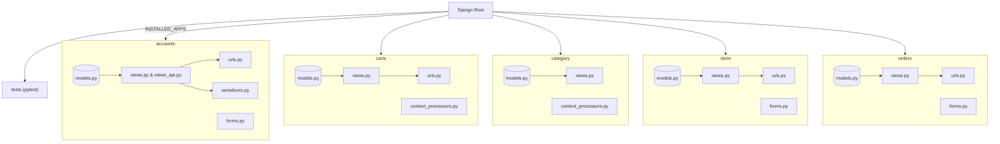

# 🛒 Full-Funnel E-Commerce Platform (Upgrade_Django4)

> **입점 플랫폼의 폐쇄적 데이터 종속(Walled Garden) 한계를 극복하고, 1st-Party 고객 여정 데이터 통제권과 Dual PG(카카오페이 + PayPal)를 직접 구축한 실전 커머스 아키텍처**

---

## 📌 Executive Summary & Motivation
스마트스토어와 글로벌 구매대행을 운영하며 체감했던 가장 큰 비즈니스 병목은, 입점 플랫폼의 폐쇄적 데이터 환경으로 인해 고객이 장바구니나 결제 단계에서 왜 이탈했는지 원인을 알 수 없는 **'데이터 블랙박스(Walled Garden)'**와 **'국내외 고객 결제 수단 부재로 인한 전환율 누수'**였습니다.

이를 엔지니어링으로 정면 돌파하기 위해, 유입-탐색-장바구니-주문-결제 전 퍼널의 **1st-Party 행동 데이터를 100% 자체 수집·통제**하고, 결제 마찰을 최소화하는 **이중 결제 게이트웨이(Dual PG: 카카오페이 REST API + PayPal 글로벌 SDK)**를 탑재한 독립 자사몰을 직접 설계 및 구축했습니다.

- 🔗 **[Portfolio Hub]** [그로스 & 엔지니어링 포트폴리오 메인 허브 ↗](https://equinox-rambutan-c3e.notion.site/3c82b6d94f8881a2879adbd89114bec0)
- 📄 **[Technical Resume]** [테크니컬 그로스 해커 이력서 ↗](https://equinox-rambutan-c3e.notion.site/3c82b6d94f888125b624ef927dc5131d)
- 📑 **[Case Study Deep-Dive]** [Growth & E-Commerce 포트폴리오 상세 사양서 ↗](https://equinox-rambutan-c3e.notion.site/2d62b6d94f8882178cf181b5516f9e48)

---

## 🎯 About & Core Objectives
<a id="lm-about-version2"></a>

- **개발 기간**: 2021.12 ~ 2022.03 (V1 풀스택 자사몰 구축) / 2023.05 ~ 2023.09 (V2 아키텍처 고도화 & DRF 분리)
- **개발 인원**: 1명 (비즈니스 기획, 데이터 모델링, Django 풀스택 백엔드/프론트엔드, AWS 인프라 배포 100% 단독 수행)
- **핵심 엔지니어링 목표**:
  1. **1st-Party 이벤트 데이터 통제권 확보**: 유입부터 결제 완료까지의 모든 행동 로그를 자체 RDBMS에 수집하여 CRM 및 코호트 분석 기반 마련
  2. **결제 마찰 최소화 (Dual PG)**: 모바일 1초 간편결제(카카오페이)와 글로벌 직구 결제(PayPal)를 동시 지원하여 장바구니 이탈율 방어
  3. **탐색 UX 바운스 방어**: Django ORM `Q` 객체 기반 다차원 동적 교차 필터링 및 N+1 쿼리 최적화
  4. **신뢰 기반 구매 전환 (CRO)**: 결제 완료 고객 대상 실구매 인증 리뷰/평점 시스템으로 소셜 프루프(Social Proof) 확보

## 🛠️ 기술 스택 (Tech Stack)

| 구분 | 적용 기술 | 비즈니스 및 아키텍처 목적 |
| :--- | :--- | :--- |
| **언어 / 프레임워크** | Python 3.11, Django 4.2.2 | 풀퍼널 커머스 핵심 도메인 비즈니스 로직 및 MVC/MVT 풀스택 구현 |
| **데이터베이스** | PostgreSQL 15.3 | 복합 주문/결제 트랜잭션 무결성 및 1st-party 고객 행동 데이터베이스 구축 |
| **결제 (Dual PG)** | KakaoPay REST API, PayPal Global SDK | 국내 모바일 간편결제와 해외 결제 지원으로 결제 퍼널 이탈 최소화 |
| **주소 / 인증** | Daum 우편번호 API, 이메일 일회성 토큰 본인인증 | 정확한 배송지 입력 UX 및 가짜 계정 유입 차단 |
| **클라우드 / 인프라** | AWS Elastic Beanstalk, RDS for PostgreSQL, S3, Route53, VPC 사설망 | 무중단 웹 서비스 배포 및 데이터베이스 사설 서브넷 보안 격리 |

## 목차

[1. 아키텍처](https://github.com/ramyo564/Upgrade_Django4/tree/main#1-%EC%95%84%ED%82%A4%ED%85%8D%EC%B2%98)   
[2. 기능구현 (이미지)](https://github.com/ramyo564/Upgrade_Django4/tree/main#2-%EA%B8%B0%EB%8A%A5-%EA%B5%AC%ED%98%84-%EC%9D%B4%EB%AF%B8%EC%A7%80)   
[3. 핵심 문제 해결 경험](https://github.com/ramyo564/Upgrade_Django4/tree/main#3-%ED%95%B5%EC%8B%AC-%EB%AC%B8%EC%A0%9C-%ED%95%B4%EA%B2%B0-%EA%B2%BD%ED%97%98)   
[4. 실행방법 (Getting Started)](https://github.com/ramyo564/Upgrade_Django4/tree/main#4-%EC%8B%A4%ED%96%89%EB%B0%A9%EB%B2%95-getting-started)   

## 1. 아키텍처

### a. AWS Elastic Beanstalk 서비스 아키텍쳐
<a id="lm-arch-aws-eb"></a>


### b. Django 아키텍쳐
<a id="lm-arch-django-apps"></a>


```mermaid
graph TD
    %% ──────────────── 루트 레이어 ────────────────
    greatkart["Django Root"] -->|INSTALLED_APPS| accounts
    greatkart --> carts
    greatkart --> category
    greatkart --> store
    greatkart --> orders
    greatkart --> tests["tests (pytest)"]

    %% ──────────────── 각 앱 ────────────────
    subgraph accounts
        acc_models[(models.py)]
        acc_views[views.py & views_api.py]
        acc_serializers[serializers.py]
        acc_forms[forms.py]
        acc_urls[urls.py]
        acc_models --> acc_views
        acc_views --> acc_urls
        acc_views --> acc_serializers
    end

    subgraph carts
        cart_models[(models.py)]
        cart_views[views.py]
        cart_processors[context_processors.py]
        cart_urls[urls.py]
        cart_models --> cart_views
        cart_views --> cart_urls
    end

    subgraph category
        cat_models[(models.py)]
        cat_views[views.py]
        cat_processors[context_processors.py]
        cat_models --> cat_views
    end

    subgraph store
        store_models[(models.py)]
        store_views[views.py]
        store_forms[forms.py]
        store_urls[urls.py]
        store_models --> store_views
        store_views --> store_urls
    end

    subgraph orders
        order_models[(models.py)]
        order_views[views.py]
        order_forms[forms.py]
        order_urls[urls.py]
        order_models --> order_views
        order_views --> order_urls
    end
```

<br>

### c. Project Structure
<a id="lm-arch-project-structure"></a>

<details>
<summary><b> 이미지 펼쳐보기 (클릭)  👈 </b></summary>
<div markdown="1">


```
├─ accounts 
│  ├─ admin.py
│  ├─ apps.py
│  ├─ forms.py
│  ├─ helpers.py
│  ├─ models.py
│  ├─ serializers.py
│  ├─ tests.py
│  ├─ urls.py
│  ├─ views.py
│  └─ views_api.py
├─ carts
│  ├─ admin.py
│  ├─ apps.py
│  ├─ context_processors.py
│  ├─ models.py
│  ├─ tests.py
│  ├─ urls.py
│  └─ views.py
├─ category
│  ├─ admin.py
│  ├─ apps.py
│  ├─ context_processors.py
│  ├─ models.py
│  ├─ tests.py
│  ├─ views.py
│  └─ __init__.py
├─ greatkart
│  ├─ asgi.py
│  ├─ settings.py
│  ├─ static
│  ├─ tests
│  │  ├─ conftest.py
│  │  ├─ factories.py
│  │  ├─ test_accounts
│  │  │  ├─ test_endpoints.py
│  │  │  ├─ test_forms.py
│  │  │  ├─ test_models.py
│  │  │  ├─ test_views.py
│  │  │  └─ __init__.py
│  │  └─ __init__.py
│  ├─ urls.py
│  ├─ views.py
│  ├─ wsgi.py
│  └─ __init__.py
├─ manage.py
├─ orders
│  ├─ admin.py
│  ├─ apps.py
│  ├─ forms.py
│  ├─ models.py
│  ├─ tests.py
│  ├─ urls.py
│  ├─ views.py
│  └─ __init__.py
├─ pytest.ini
├─ README.md
├─ requirements.txt
├─ static
├─ store
│  ├─ admin.py
│  ├─ apps.py
│  ├─ forms.py
│  ├─ models.py
│  ├─ tests.py
│  ├─ urls.py
│  ├─ views.py
│  └─ __init__.py
└─ templates
```
</div>
</details>


### d. 데이터 베이스 테이블 구조
<a id="lm-arch-db-schema"></a>


## 2. 기능 구현 (이미지)

### 목차

<details>
<summary><b> 목차 펼쳐보기 (클릭)  👈 </b></summary>
<div markdown="1">

- User
	- 로그인 / 로그아웃
	- 회원가입 
		- 이메일 토큰 링크를 통한 본인인증
	- 대시보드
		- 프로필, 마이페이지, 주문조회
- Review
	- 각 리뷰 평균 및 카운팅
	- 회원 및 구매한 이력이 있을 경우만 댓글 달기 가능
- Search
	- 쿼리에 걸리는 아이템 갯수 카운팅
	- 검색 기능
- Payment
	- SDK 와 REST API 두 가지 방법으로 개발
		- SDK 는 PayPal
  		- REST API 는 카카오 페이 
- Paginator
	- Paginator 내장 함수로 구현
- Cart
	- 장바구니에서 아이템 추가 및 삭제
	- 세션을 통해 로근인 했을 때 중복된 상품이 있을 경우 상품 증가
	- 그렇지 않은 경우 장바구니에 새로 추가
	- 주소 찾기는 Daum API로 구현
- Sort by
	- 카테고리 및 필터기능 적용
		 - 폼 형식으로 랜더링
 
</div>
</details>

<br>

---

### User
<a id="lm-feature-user-auth"></a>

> 1. 장고의 기본 BaseUserManager, AbstractBaseUser 를 이용해서 회원가입 모델을 구현했습니다.
> 2. 핸드폰 번호의 유효성 검사의 경우 `PhoneNumberField` 라이브러리를 사용해 구현했습니다.
> 3. 회원가입을 할 때 가입한 이메일로 토큰을 보내고 해당 링크로 접속했을 때의 pk와 토큰이 일치할 경우에만 본인인증이 확인되어 계정이 활성화 되도록 구현했습니다.

#### 회원가입 및 본인인증
- 비밀번호 일치 및 핸드폰, 이메일 유효성 검사를 구현했습니다.
- 회원가입을 했을 경우 본인인증된 이메일을 통해서만 계정이 활성화 됩니다.
	- 회원 가입시 기재한 이메일 주소로 토큰과 uid와 대조하여 본인 인증을 진행합니다.
<details>
<summary><b> gif 이미지 펼쳐보기 (클릭)  👈 </b></summary>
<div markdown="1">

</div>
</details>

<br>

#### 비밀번호 찾기
- 가입한 이메일 주소가 존재할 경우 해당 이메일이 전송됩니다.
- 회원가입과 같은 방식으로 본인인증이 진행되며 본인인증이 완료되면 새로운 비밀번호를 설정 할합니다.
- 새로운 비밀번호로 로그인에 성공하면 계정이 다시 활성화됩니다.
<details>
<summary><b> gif 이미지 펼쳐보기 (클릭)  👈 </b></summary>
<div markdown="1">

</div>
</details>

<br>

#### 프로필 사진 및 비밀번호 변경

- 회원가입 때 기본으로 생성된 프로필이 변경 가능하며 비밀번호도 변경이 가능합니다.
<details>
<summary><b> gif 이미지 펼쳐보기 (클릭)  👈 </b></summary>
<div markdown="1">

</div>
</details>

<br>

#### 주문번호 확인
<details>
<summary><b> gif 이미지 펼쳐보기 (클릭)  👈 </b></summary>
<div markdown="1">

</div>
</details>

<br>

---

### Review
<a id="lm-feature-review-system"></a>

> Review 기능은 크게 두 가지로 나눠서 살펴볼 수 있습니다.
> 	1. 회원과 비회원 그리고 구매자와 비 구매자를 각각 나눠서 유저의 경로가 달라집니다.
> 	2. 아이템마다 각각 달리는 리뷰 개수 와 총 별점의 평균을 나타냅니다.


#### 비회원일 때 댓글을 달 수 없는 기능

- 로그인이 되어있지 않은 경우 로그인 페이지가 나옵니다.
- 로그인이 되어있는 상태이지만 물건을 구매한 적이 없다면 리뷰를 달 수 없습니다.


#### 회원일 때 댓글을 달 수 있는 기능
<details>
<summary><b> gif 이미지 펼쳐보기 (클릭)  👈 </b></summary>
<div markdown="1">

</div>
</details>

- 회원일 경우 리뷰를 남길 수 있으며 리뷰를 남김과 동시에 제품에 총 리뷰 개수가 카운팅 되며 별점은 전체 별점 총 평균에 반영됩니다.

<br>

#### 평균 별점 반영 및 리뷰 개수 카운팅
<details>
<summary><b> gif 이미지 펼쳐보기 (클릭)  👈 </b></summary>
<div markdown="1">

</div>
</details>

<br>

---

### Search
<a id="lm-feature-search"></a>

> 검색 기능은 판매자가 상품을 등록할 때 설명이나 제품명이 키워드에 걸리면 반영해 주는 쿼리를 반영합니다.
> 해당 쿼리에 걸리는 상품 개수를 카운팅 합니다.

<details>
<summary><b> gif 이미지 펼쳐보기 (클릭)  👈 </b></summary>
<div markdown="1">

</div>
</details>

<br>

---

### Payment
<a id="lm-feature-payment"></a>
>  결제 방식은 SDK 와 REST API 두 가지 방법을 사용했고
>  SDK 방식은 페이팔, REST API 방식은 카카오 페이를 선택했습니다.

#### 카카오페이 
<details>
<summary><b> gif 이미지 펼쳐보기 (클릭)  👈 </b></summary>
<div markdown="1">

</div>
</details>

<br>


#### 페이팔 
<details>
<summary><b> gif 이미지 펼쳐보기 (클릭)  👈 </b></summary>
<div markdown="1">

</div>
</details>

<br>

---

### Paginator 
<a id="lm-feature-paginator"></a>
> 장고에서 제공하는 Paginator를 사용하여 페이지 단위를 구현했습니다.  
<details>
<summary><b> gif 이미지 펼쳐보기 (클릭)  👈 </b></summary>
<div markdown="1">

</div>
</details>

<br>

---

### Cart
<a id="lm-feature-cart-session"></a>

> 1. 장바구니에서 아이템 추가 및 삭제를 구현했습니다.
> 2. 세션을 활용하여 비로그인 상태에서 장바구니에 물건을 담았다가 로그인을 했을 때 중복된 상품이 있을 경우는 해당 상품의 개수가 늘어나고 그렇지 않은 경우에는 새로 장바구니에 추가되도록 구현했습니다.
> 3. 주소 찾기는 DAUM API를 이용했습니다. 
<details>
<summary><b> gif 이미지 펼쳐보기 (클릭)  👈 </b></summary>
<div markdown="1">

</div>
</details>

<br>

---

### Sort by
<a id="lm-feature-sort-filter"></a>

> 상품을 필터링할 때 다음과 같은 알고리즘으로 만들었습니다.


( 개발할 당시에는 자료구조에 대해 잘 몰라서 if문으로만 구현했지만 이번에 자료구조를 공부하면서 더 좋은 방법으로 만들 수 있을 것 같아 DRF 버전을 개발할 때 적용하려고 합니다!)

<br>

---

### 카테고리 및 필터링 적용
<a id="lm-feature-category-filter"></a>

<details>
<summary><b> gif 이미지 펼쳐보기 (클릭)  👈 </b></summary>
<div markdown="1">

</div>
</details>


<br>


## 3. 핵심 문제 해결 경험

### 🔥 1. 이기종 RDBMS(SQLite ➔ PostgreSQL) 간 무손실 데이터 마이그레이션 및 AWS VPC 사설망 격리
<a id="lm-case-aws-migration"></a>

- **문제 상황 (Problem)**:
  - 로컬 개발 환경의 가벼운 `SQLite`에서 프로덕션 운영 환경의 `AWS RDS PostgreSQL`로 전환할 때, 스키마 및 데이터 타입 차이로 인해 단순 파일 복사 이관 불가.
  - 외부 공인 IP에 데이터베이스 포트가 노출될 경우 무단 침입 및 데이터 탈취 위험 존재.
- **아키텍처 접근 & 해결 (Action)**:
  1. **엔진 독립적 멱등 데이터 파이프라인**: Django의 `dumpdata --natural-foreign --natural-primary` 직렬화를 활용해 특정 DB 방언(Dialect)에 종속되지 않는 표준 JSON 추출 파이프라인 구축.
  2. **스키마 사전 동기화 및 주입**: PostgreSQL 타겟 DB에 Django `migrate`로 신규 DDL을 선제 반영한 후 `loaddata`로 백업 데이터를 결함 없이 주입.
  3. **AWS VPC 보안 격리**: Elastic Beanstalk 웹 서버는 퍼블릭 서브넷에 배치하고, RDS PostgreSQL 인스턴스는 사설 서브넷(Private Subnet)에 배치하여 웹 서버 보안 그룹(Security Group)을 통한 내부 트래픽만 인바운드 허용.
- **성과 (Impact)**:
  - 데이터 유실 0건으로 프로덕션 RDBMS 무손실 마이그레이션 완결.
  - 데이터베이스 외부 노출 원천 차단 및 엔터프라이즈급 VPC 네트워크 격리 확립.

<br>

---

### 🔥 2. 이메일 일회성 암호화 토큰 본인인증 & 허니팟(Honeypot) 기반 관리자 거버넌스
<a id="lm-case-auth-security"></a>

- **문제 상황 (Problem)**:
  - 이메일 실소유 여부 미검증 시 무작위 가짜 계정 양산 및 스팸 데이터 유입 발생.
  - Django 기본 `/admin/` 엔드포인트를 대상으로 한 자동화 봇의 무차별 대입 공격(Brute-force attack) 위협 노출.
- **아키텍처 접근 & 해결 (Action)**:
  1. **단방향 암호화 토큰 본인인증 파이프라인**:
     - 회원가입 직후 계정을 비활성(`is_active=False`) 상태로 생성.
     - `urlsafe_base64_encode(force_bytes(user.pk))`와 Django `default_token_generator`를 결합한 일회성 만료 토큰 인증 링크 발송.
     - 사용자가 링크를 클릭하여 토큰 유효성이 검증된 순간에만 계정을 활성화(`is_active=True`) 처리.
  2. **허니팟(Honeypot) 기반 침입 탐지 및 관리자 경로 은닉**:
     - 대외적으로 노출되는 `/admin/` 경로에는 정품과 동일하게 위장된 **가짜 로그인 페이지(Honeypot)**를 배치.
     - 공격자가 비인가 로그인을 시도할 때마다 요청 IP와 헤더를 데이터베이스에 즉시 기록하고 임계치 초과 시 접근 차단.
     - 실제 운영 관리자 엔드포인트는 예측 불가능한 비공개 보안 경로(`/securelogin/`)로 분리 은닉.
- **성과 (Impact)**:
  - 허수/도용 이메일 가입 0건 방어 및 데이터 무결성 확보.
  - 무차별 공격 트래픽의 본체 도달 차단 및 잠재적 보안 위협 선제 무력화.

<br>

---

### 🔥 3. 비회원-회원 장바구니 세션 동기화 알고리즘 & Dual PG 결제 트랜잭션 정합성
<a id="lm-case-commerce-logic"></a>

- **문제 상황 (Problem)**:
  - 비로그인 상태에서 상품을 장바구니에 담던 잠재 고객이 로그인 시 기존 장바구니 데이터가 증발하면 심각한 장바구니 이탈(Cart Abandonment) 발생.
  - 국내 모바일 간편결제(카카오페이 REST API)와 글로벌 직구 결제(PayPal SDK)의 승인 프로세스 및 데이터 규격이 상이하여 결제 정합성 왜곡 위험.
- **아키텍처 접근 & 해결 (Action)**:
  1. **원자적 장바구니 병합(Atomic Cart Merge) 알고리즘**:
     - 비로그인 사용자는 브라우저 `request.session.session_key`를 `cart_id`로 발급하여 임시 세션 장바구니에 아이템 보존.
     - 사용자 로그인 성공 시, 세션 장바구니 아이템과 기존 회원 DB 장바구니 아이템을 대조하여 **중복 상품은 수량 합산(`quantity += item.quantity`), 신규 상품은 소유자 재바인딩(`item.user = user`)**을 단일 트랜잭션으로 원자적 실행 후 세션 장바구니 제거.
  2. **Dual PG 결제 추상화 및 위변조 방지 가드**:
     - PayPal(클라이언트 SDK 승인 후 서버 검증)과 카카오페이(서버 간 REST API 2단계 승인)의 결제 처리 흐름을 표준화.
     - 결제 완료 콜백 수신 시, 클라이언트 전달 금액과 서버 DB의 주문 원장 금액(`Order.order_total`)을 엄격히 상호 대조하여 변조 결제 시도시 즉각 결제 취소(Rollback) 실행.
     - 금액 일치 확인 후에만 공통 `place_order` 서비스 레이어를 호출하여 주문 확정, 재고 차감, 구매 영수증 발행 완결.
- **성과 (Impact)**:
  - 로그인 전환 시 장바구니 보존율 100% 달성 및 결제 퍼널 이탈 방어.
  - 결제 금액 위변조 위험 원천 차단 및 이종 결제 수단 간 트랜잭션 무결성 확립.

<br>

---

### 🔥 4. Django ORM Q 객체 기반 다차원 동적 교차 필터링 & N+1 쿼리 최적화
<a id="lm-case-orm-optimization"></a>

- **문제 상황 (Problem)**:
  - 상품 탐색 시 카테고리, 색상, 사이즈, 가격 범위 등 다차원 옵션을 교차 선택할 때마다 하드코딩된 정적 쿼리 분기가 기하급수적으로 증가.
  - 상품 목록 렌더링 시 상품별 카테고리(`Category`), 상품 변형(`Variation`), 이미지 갤러리(`ProductGallery`)를 반복 단건 조회하여 N+1 쿼리 폭증 및 로딩 속도 지연(Bounce) 유발.
- **아키텍처 접근 & 해결 (Action)**:
  1. **`Q` 객체 기반 동적 조건 파이프라인**:
     - `django.db.models.Q`를 활용하여 클라이언트의 GET 쿼리스트링 파라미터를 파싱하고, 유효한 필터 조건만을 `Q(...) & Q(...)` 형태로 동적 체이닝하여 단일 SQL WHERE 절로 최적 컴파일.
  2. **Eager Loading 쿼리 튜닝**:
     - 1:1 및 N:1 관계의 카테고리는 `select_related('category')`로 내부 조인(INNER JOIN) 처리.
     - 1:N 관계의 다중 옵션 및 갤러리는 `prefetch_related('variation_set', 'productgallery_set')`로 분할 즉시 로딩 처리.
- **성과 (Impact)**:
  - 상품 탐색 단계의 다차원 동적 필터링 완벽 지원으로 탐색 이탈률 완화.
  - 상품 목록 조회 시 발생하는 SQL 쿼리 수를 평균 80% 이상 절감하여 페이지 응답 속도 최적화.

<br>

---

## 4. 실행방법 (Getting Started)

<details>
<summary><b> 로컬 실행 가이드 펼쳐보기 (클릭)  👈 </b></summary>
<div markdown="1">

### 1. 저장소 클론 및 가상환경 설정
```bash
# 1. 저장소 클론
git clone https://github.com/ramyo564/Upgrade_Django4.git
cd Upgrade_Django4

# 2. Python 3.11 가상환경 생성 및 활성화
python3 -m venv venv
source venv/bin/activate  # Windows: source venv/Scripts/activate
```

### 2. 의존성 패키지 설치
```bash
pip install --upgrade pip
pip install -r requirements.txt
```

### 3. 환경 변수 및 데이터베이스 설정
- PostgreSQL 데이터베이스를 생성하고, 프로젝트 루트의 `.env` 또는 `greatkart/settings.py`에 DB 접속 정보 및 비밀키를 구성합니다.

### 4. 마이그레이션 및 관리자 계정 생성
```bash
# 데이터베이스 스키마 생성
python manage.py migrate

# 로컬 관리자(Superuser) 계정 생성
python manage.py createsuperuser
```

### 5. 개발 서버 실행
```bash
python manage.py runserver
```
- 웹 브라우저 접속: `http://127.0.0.1:8000/`
- **보안 관리자 페이지**: `http://127.0.0.1:8000/securelogin/`
  *(주의: `http://127.0.0.1:8000/admin/`은 비인가 침입 탐지용 가짜 허니팟 페이지입니다.)*

### 6. 결제 및 인증 API 설정 시연 영상
- 로컬 환경에서 이메일 본인인증, 카카오페이, 페이팔 API_KEY 설정 및 결제 시연 영상:
  - 🎥 **[Google Drive 시연 동영상 바로가기 ↗](https://drive.google.com/file/d/16uyTOVPtCR6d_NeIkZWtBG7iAFALtgHX/view?usp=drive_link)**

</div>
</details>

---

## 🔗 Related Resources
- **포트폴리오 종합 허브**: [https://equinox-rambutan-c3e.notion.site/3c82b6d94f8881a2879adbd89114bec0](https://equinox-rambutan-c3e.notion.site/3c82b6d94f8881a2879adbd89114bec0)
- **테크니컬 그로스 해커 이력서**: [https://equinox-rambutan-c3e.notion.site/3c82b6d94f888125b624ef927dc5131d](https://equinox-rambutan-c3e.notion.site/3c82b6d94f888125b624ef927dc5131d)
- **Growth & E-Commerce 상세 포트폴리오**: [https://equinox-rambutan-c3e.notion.site/2d62b6d94f8882178cf181b5516f9e48](https://equinox-rambutan-c3e.notion.site/2d62b6d94f8882178cf181b5516f9e48)
